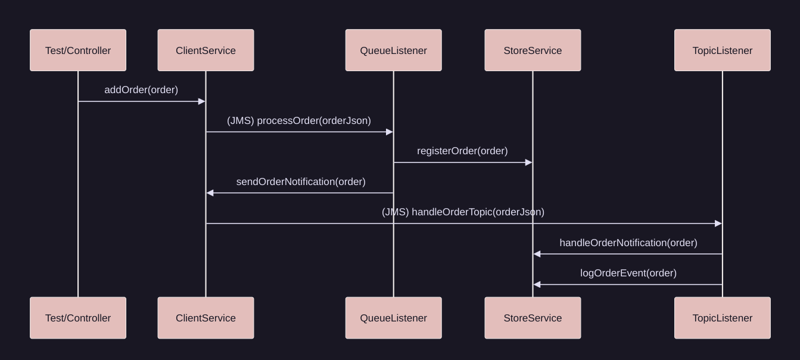

# JMS Demo Project
A Spring Boot application demonstrating asynchronous messaging with JMS and ActiveMQ.
It models a typical enterprise scenario where orders are processed via a queue and notifications are broadcast via a topic.

## Table of Contents
- [Overview](#overview)
- [How It Works](#how-it-works)
- [Features](#features)
- [Getting Started](#getting-started)
- [Usage](#usage)
- [Testing](#testing)
- [Project Structure](#project-structure)
- [Configuration](#configuration)

## Overview

This project shows how to:
- Send and receive messages using JMS with ActiveMQ.
- Use queues for order processing (point to point).
- Use topics for notifications (publish/subscribe, with durable subscriptions)
- Serialize messages as JSON for interoperability

## How It Works



- Orders are sent to a queue and processed by a single consumer.
- Notifications are sent to a topic and received by all subscribers (with durable subscription).

## Features

- Spring Boot JMS integration
- ActiveMQ Classic as the message broker
- Queue-based order processing
- Topic-based notification broadcasting
- JSON message serialization
- Example unit/integration test for message flow

## Getting Started
### Prerequisites

This project was developed and tested with:

- Java 21.0.7
- ActiveMQ Classic 6.1.5
- Apache Maven 3.8.7

## ActiveMQ Classic on Docker

Download the docker image from the Internet to your local machine:

```bash
docker pull apache/activemq-classic:latest
```

Create the docker container:

```bash
docker run -d --name activemq-classic -p 61616:61616 -p 8161:8161 apache/activemq-classic:latest
```

To check if it's running:

```bash
docker ps
```

Copy this link in your browser:
- http://localhost:8161/admin
- Credentials (by default):
  - user: admin
  - pw:   admin

Run this command to stop the container:

```bash
docker stop activemq-classic
```

Run this command to start it again:

```bash
docker start activemq-classic
```

## Usage

1. Start ActiveMQ Classic (see above).
2. Build the project:
   ```bash
   mvn clean package
   ```
3. Run the Spring Boot application:
   ```bash
   mvn spring-boot:run
   ```
4. The application will send and receive messages using the configured queue and topic.

## Testing

To run the tests:

```bash
mvn test
```

The test suite includes:
- Sending an order to the queue and verifying it is processed.
- Broadcasting a notification to the topic and verifying it is received by subscribers.

## Project Structure

```
jmsdemo/
├── images/
│   └── sequence-diagram.png
├── src/
│   ├── main/
│   │   ├── java/com/cei/
│   │   │   ├── JmsConfiguration.java
│   │   │   ├── JmsDemoApplication.java
│   │   │   ├── listener/SimpleListener.java
│   │   │   ├── model/Order.java
│   │   │   └── service/
│   │   │       ├── ClientService.java
│   │   │       ├── ClientServiceImpl.java
│   │   │       ├── StoreService.java
│   │   │       └── StoreServiceImpl.java
│   │   └── resources/
│   │       ├── application.properties
│   │       ├── static/
│   │       └── templates/
│   └── test/
│       └── java/com/cei/SimpleListenerTest.java
├── pom.xml
└── README.md
```

## Configuration

The main configuration is in `src/main/resources/application.properties`. Example properties:

```
spring.activemq.broker-url=tcp://localhost:61616
spring.activemq.user=admin
spring.activemq.password=admin

```

You can adjust broker settings as needed.